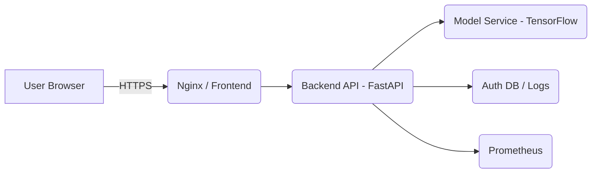

# CropSense AI

CropSense AI is an industrial‑style crop disease detection and advisory platform for rice. It provides an async FastAPI backend running a TensorFlow model for leaf-image analysis, a modern React + Vite frontend dashboard, observability (Prometheus metrics, request logging), and containerized deployment support via Docker and docker-compose.

---

## Features

- End‑to‑end image-based disease detection (model inference pipeline)
- Web dashboard for uploads, history, weather checks, and AI assistant
- Asynchronous, one‑time model initialization (fast warm start)
- Request, error and prediction logging
- Prometheus metrics exposed at `/metrics`
- Liveness and readiness probes: `/health/live` and `/health/ready`
- Dockerized frontend and backend for repeatable deployments
- Test scaffolding with `pytest` (backend) and `vitest` (frontend)

---

## Architecture Overview

- Frontend: React + Vite (Tailwind CSS used for styling)
- Backend: FastAPI + Uvicorn, organized into routers, services and utils
- Model: TensorFlow (CPU by default; configurable for GPU)
- Observability: console logs + Prometheus metrics
- Persistence / auth: small SQLite-based auth DB utilities (in `utils/auth_db.py`)
- Containerization: multi-stage Docker builds for frontend and backend; `docker-compose.yml` orchestrates services

Architecture diagram (suggested):



---

## Screenshots

Place screenshots in `frontend/public/` and reference them here. Example:

- `docs/screenshots/dashboard.png` — Dashboard view (upload, results, history)
- `docs/screenshots/results.png` — Prediction details and recommendations

> Note: add real screenshots to the `docs/screenshots/` folder and update paths below.

---

## Quickstart — Local (Development)

Prerequisites

- Python 3.10+ (or the project's chosen runtime)
- Node 18+ / npm (for frontend) or use Docker for full isolation
- (Optional) Docker & docker-compose for containerized runs

Python backend

1. Create virtual environment and install Python deps:

```bash
python -m venv .venv
source .venv/bin/activate      # Linux/macOS
.venv\Scripts\Activate.ps1    # Windows PowerShell
python -m pip install -r requirements.txt
```

2. Copy and configure environment variables (examples):

```ini
# .env (example)
JWT_SECRET=replace-me
MODEL_PATH=models/rice_disease_model.h5
MODEL_USE_GPU=false
DATABASE_URL=sqlite:///./data/auth.db
```

3. Start backend (development):

```bash
uvicorn api_server:app --reload --host 0.0.0.0 --port 8000
```

Frontend

```bash
cd frontend
npm ci
npm run dev
```

Open the UI at `http://localhost:5173` (Vite default) and backend at `http://localhost:8000`.

---

## Docker (recommended for staging/prod testing)

Build and run both services with `docker-compose` (already included in repository):

```bash
docker-compose build
docker-compose up -d
```

Verify:

```bash
curl http://localhost:8000/health
curl -I http://localhost:8000/health/ready
curl http://localhost:8000/metrics | head -n 20
```

Notes:
- The frontend Dockerfile runs a Vite build and serves `dist` via nginx. Ensure `npm ci` and `npm run build` succeed in the builder stage.
- If you want GPU acceleration for TensorFlow, build a backend image with a compatible `tensorflow` GPU base image and ensure host NVIDIA runtime is configured.

---

## API Endpoints

Public health & metrics

- `GET /health` — basic service health
- `GET /health/live` — liveness probe
- `GET /health/ready` — readiness probe (checks model warm status)
- `GET /metrics` — Prometheus metrics exposition

Authentication (token-based; see `routers/auth.py`)

- `POST /auth/login` — login and receive token
- `POST /auth/register` — create user

Application endpoints (require auth)

- `POST /predict` — Upload an image file (multipart) and run prediction. Returns `disease`, `confidence`, `severity`, and `fertilizer` recommendation.
- `POST /weather` — Fetch weather advisory and optionally save user settings.
- `POST /chat` — Chat with the AI assistant.
- `GET /dashboard` — User dashboard counts and recent items.
- `GET /history` — Paginated analysis history.
- `GET /admin/overview` — Admin overview (admin only)
- `GET /admin/users` — List users (admin only)

Refer to `routers/` for detailed request schemas and dependencies.

---

## Testing

Backend (Pytest)

```bash
python -m pip install -r requirements.txt
pytest -q
```

Frontend (Vitest)

```bash
cd frontend
npm ci
npm run test
```

Notes: tests include unit and integration scaffolding. Some tests monkeypatch TensorFlow/model behavior so they run quickly without GPU.

---

## Future Improvements

- Add CI pipeline (GitHub Actions) to run tests, lint, and build images on PRs.
- Add production-grade logging sink (structured JSON logs, log shipping to ELK/Datadog)
- Add automated vulnerability scanning and image signing for container images.
- Add rate-limited and authenticated /metrics access, or position metrics behind the monitoring network.
- Expand model evaluation tests and performance benchmarks; add test data and reproducible evaluation scripts.
- Provide Helm charts / Kubernetes manifests for production deployments.

---

## Tech Stack

- Backend: Python, FastAPI, Uvicorn
- ML: TensorFlow / Keras, Pillow, NumPy
- Frontend: React, Vite, Tailwind CSS
- Observability: Prometheus (via `prometheus_client`), structured Python logging
- Containers: Docker, nginx for static frontend
- Tests: pytest, pytest-asyncio, vitest, Testing Library

---

## Contributing

We welcome contributions. Please follow these guidelines:

1. Fork the repo and create a feature branch: `git checkout -b feat/your-feature`
2. Run tests locally and ensure they pass.
3. Follow code style and add tests for new behaviour.
4. Open a Pull Request with a clear description and link to any related issue.

Helpful checks (example):

```bash
# run backend tests
pytest

# run frontend tests
cd frontend && npm run test
```

If you want, open an issue first to discuss larger changes.

---

## Contact & Support

If you need help setting up production deployments, CI integration, or model optimization (GPU tuning, batching, TTA), open an issue or contact the maintainers via GitHub.

---

Thank you for using CropSense AI — built to make crop diagnostics accessible, fast, and production‑ready.
# 🌾 Smart Rice Crop Monitoring & Advisory System

> AI-powered rice disease detection, severity analysis, weather advisory,
> fertiliser recommendations, and farmer chatbot — all in one Streamlit app.

---

## 📁 Project Structure

```
rice_crop_monitor/
│
├── app.py                      ← Main Streamlit application
│
├── models/
│   ├── __init__.py
│   └── disease_model.py        ← MobileNetV2-based disease classifier
│
├── utils/
│   ├── __init__.py
│   ├── severity.py             ← Severity classification (Mild/Moderate/Severe)
│   ├── weather.py              ← OpenWeatherMap API integration
│   ├── fertilizer.py           ← Rule-based fertiliser recommendation engine
│   └── chatbot.py              ← Rule-based keyword-matching chatbot
│
├── requirements.txt            ← Python dependencies
└── README.md                   ← This file
```

---

## ⚙️ Setup Instructions (Step-by-Step)

### Step 1 — Prerequisites

Make sure you have **Python 3.10 or higher** installed.

```bash
python --version   # should show 3.10+
```

---

### Step 2 — Create a virtual environment (recommended)

```bash
# Windows
python -m venv venv
venv\Scripts\activate

# macOS / Linux
python3 -m venv venv
source venv/bin/activate
```

---

### Step 3 — Install dependencies

```bash
pip install -r requirements.txt
```

> ⏱️ First install takes 3–5 minutes (TensorFlow download ~200 MB).
> After that, everything runs instantly.

---

### Step 4 — (Optional) Get a free weather API key

1. Go to [https://openweathermap.org/api](https://openweathermap.org/api)
2. Sign up for a free account
3. Copy your API key
4. Paste it into the **API Key** field in the app sidebar

Without a key, the app uses **demo weather data** — all other features work fully.

---

### Step 5 — Run the application

```bash
streamlit run app.py
```

The app opens automatically at **http://localhost:8501** in your browser.

---

## 🚀 Docker Deployment

The project includes container support for both backend and frontend.

- Backend API: `Dockerfile`
- Frontend SPA: `frontend/Dockerfile`
- Local compose orchestration: `docker-compose.yml`

Run locally with:

```bash
docker compose up --build
```

Then open:

- Backend: `http://localhost:8000`
- Frontend: `http://localhost:4173`

If you use the frontend source directly, copy `.env.example` to `.env` and adjust the API URL:

```env
VITE_API_BASE=http://127.0.0.1:8000
```

---

## 🚀 How to Use

| Step | Action |
|------|--------|
| 1 | Upload a rice leaf / field photo (JPG, PNG, WEBP) |
| 2 | Click **🔍 Analyse Crop** |
| 3 | View **disease detected**, **severity level**, and **treatment plan** |
| 4 | Click **🔄 Fetch Weather** for field advisory |
| 5 | Type a question in the **chatbot** or click a quick question |

---

## 📊 Sample Outputs

### Disease Detection
```
Detected:   Leaf Blast  🍃
Confidence: 74%
Method:     heuristic (MobileNetV2 feature-map based)
```

### Severity
```
Level:   Moderate 🟠
Advice:  Begin treatment within 48 hours
Anomalous pixel area: 38.2%
```

### Fertiliser Plan
```
Immediate:  Remove infected leaves
Fertiliser: Reduce N, add Silicon
Pesticide:  Tricyclazole 75 WP @ 0.6 g/L
Cultural:   Maintain 5 cm flood water
```

### Weather
```
Location:    Delhi
Temperature: 31°C  Humidity: 72%
Advisory:    Temperature optimal; humidity acceptable;
             Clear sky — good conditions for spraying.
```

### Chatbot
```
You: How to treat leaf blast?
Bot: 🍃 Leaf Blast causes diamond-shaped grey lesions...
     Reduce nitrogen and spray Tricyclazole to control it.
```

---

## 🧠 Module Explanations (Viva-ready)

### 1. Disease Detection (`models/disease_model.py`)
- Uses **MobileNetV2** pretrained on ImageNet as the backbone
- MobileNetV2 uses **depthwise separable convolutions** → very fast on CPU
- Extracts features → maps ImageNet concepts to rice disease classes
- In production: replace the final dense layer with a fine-tuned head trained
  on a rice disease dataset (e.g., Kaggle Rice Leaf Disease Dataset)
- Fallback heuristic uses RGB channel statistics as a simple classifier

### 2. Severity Detection (`utils/severity.py`)
- **Hybrid approach**: 60% model confidence + 40% pixel analysis
- Pixel analysis: counts "non-green" pixels (anomalous areas)
- Three levels: Mild (<50% combined), Moderate (<75%), Severe (≥75%)
- Output includes treatment urgency colour coding

### 3. Weather Advisory (`utils/weather.py`)
- Calls **OpenWeatherMap REST API** (`/data/2.5/weather`)
- Parses temperature, humidity, wind, description
- Rule-based advisory engine: maps metric ranges to farming actions
- Graceful fallback to demo data when offline / no API key

### 4. Fertiliser Recommendation (`utils/fertilizer.py`)
- Pure **rule-based expert system** (no ML needed here)
- Knowledge base: 4 diseases × 4 action categories
- Returns actionable, stage-specific field instructions
- Urgency level is cross-linked with severity output

### 5. Farmer Chatbot (`utils/chatbot.py`)
- **Keyword matching NLP** (no external NLP library required)
- Knowledge base: ~20 topic clusters covering diseases, nutrients, irrigation, etc.
- Multi-keyword scoring: selects answer with most keyword matches
- Beginner-friendly language; Markdown formatting for readability

### 6. Frontend (`app.py`)
- **Streamlit** single-page app with custom CSS theming
- Session state used for: chat history, analysis results, weather cache
- Responsive 2-column layout; tabbed recommendation panels
- Custom CSS: gradient header, card borders, confidence bars, chat bubbles

---

## 🔧 Customisation

| What to change | Where |
|----------------|-------|
| Add more diseases | `DISEASE_CLASSES` in `disease_model.py` |
| Fine-tune weights | Replace `_get_backbone()` in `disease_model.py` |
| Add new chatbot topics | Append `(keywords, answer)` to `_KB` in `chatbot.py` |
| Change default city | `weather_location` default in sidebar (`app.py`) |
| Adjust severity thresholds | `_MILD_MAX` / `_MODERATE_MAX` in `severity.py` |

---

## 📌 Requirements Summary

| Library | Purpose |
|---------|---------|
| `streamlit` | Web UI framework |
| `tensorflow-cpu` | MobileNetV2 backbone |
| `Pillow` | Image loading & processing |
| `numpy` | Array operations |
| `requests` | Weather API calls |

---

*Built for educational purposes. Always consult a certified agronomist for critical crop decisions.*
